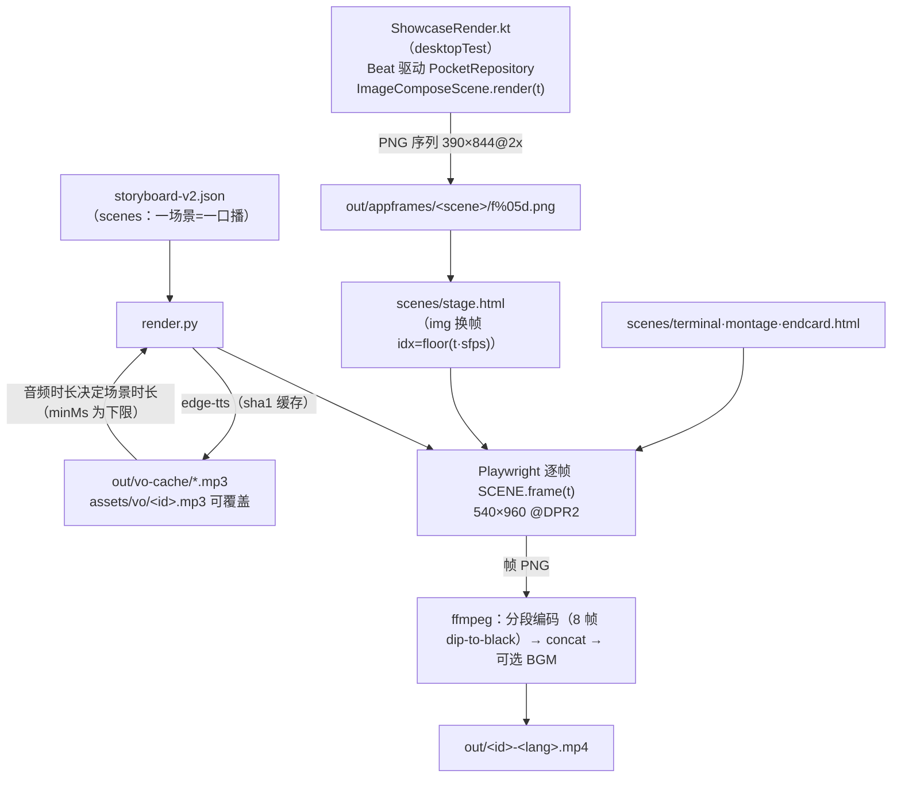

# 管线审计（阶段 0 交付物，2026-07-13）

## 当前数据流

确定性契约：**画面 = t 的纯函数**。CSS 动画被 rig 冻结、Compose 由 render(tNanos) 推进、真 UI 帧按索引取。

## 已有能力 vs 方案缺口

| 方案要求 | 现状 | 缺口 |
|---|---|---|
| 场景=一口播、时长随 TTS | ✅ render.py 已有 | 需升级为「段（segment）多镜头（shot）」模型（钩子段要终端↔footage 交叉剪） |
| 真 UI 帧序列合成 | ✅ stage.html img 换帧 | footage 帧走同机制即可（footage.html） |
| 冻结尾帧 | ✅ `Math.min(N-1,idx)` 已是 stage 现行为 | loop/error 两档 shortagePolicy 待加 |
| 分段 TTS + 缓存 + 外部覆盖 | ✅ | 无 |
| 时长求解器 / timeline.lock | ❌ | 新做（resolve-timeline） |
| facts.lock | ❌ | 新做（lock-facts） |
| animatic + 占位 | ❌ | 新做（placeholder.html + --allow-placeholder） |
| FootageScene 六字段 | ❌ | 新做（ffmpeg 抽帧→PNG 缓存，禁 video seek） |
| contact sheet | ❌ | 新做（ffmpeg tile） |
| 红线词扫描（validate 最小版） | ❌ | 新做（词表扫 vo/caption） |
| video.sh 薄转发 | ❌ | 新做（逻辑全在 render.py 子命令） |

## 评审事实复核（执行要求第 5 条）

- 授权超时 UI：`Permissions.kt:436 CountdownRing`、`:418 timedOutSignal`、`:448 auto_denied_title` ✅ 仍成立（倒计时须 Beat 注入，wall-clock 不确定性确认）
- Fleet 跨机限制：`FleetModel.kt:110`「Today only the focused machine's link ever carries an ask」✅ 仍成立（分镜已按此约束）
- 断线补齐：`data/TranscriptMerge.kt` ✅ 存在
- appframes 现货：sessions / stream / askq / done / diff / usage 六场景 ✅
- 展示代码隔离：ShowcaseRender 在 desktopTest 源集，唯一 prod 触碰仍是 ChatScreen internal ✅

## 本轮决策记录

- **可灵移除**（2026-07-13 用户裁定）：素材链 = Seedance 多候选 → 换关键帧重试 → StageScene 降级；generation.json 不再有 fallbackProvider
- Seedance 供应商待定（GPTProto key 无效待修 / 用户自开火山方舟账号），**不阻塞**：阶段 0/1 全部走 placeholder
- 新产物目录：`marketing/video/output/`（locks、animatic、成片）；缓存仍在 `out/`（vo-cache、appframes、footage-cache）
